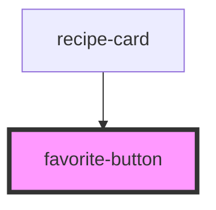

# favorite-button

<!-- Auto Generated Below -->

## Overview

`favorite-button` is a standalone, stateless toggle. It never owns the
favorite state itself — the consuming app passes in `active` as a prop
and listens for `favoriteToggle` to update its own store. This lets the
same component be reused inside `recipe-card` and independently on the
recipe detail page.

## Properties

| Property | Attribute | Description                                                                 | Type           | Default |
| -------- | --------- | --------------------------------------------------------------------------- | -------------- | ------- |
| `active` | `active`  | Whether this recipe is currently favorited.                                 | `boolean`      | `false` |
| `size`   | `size`    | Optional size variant for use in different contexts (card vs. detail page). | `"lg" \| "sm"` | `'sm'`  |

## Events

| Event            | Description                                                                                                                                                                                                     | Type                                   |
| ---------------- | --------------------------------------------------------------------------------------------------------------------------------------------------------------------------------------------------------------- | -------------------------------------- |
| `favoriteToggle` | Fired on click with the value the app should set the favorite state to. Named `favoriteToggle` (not `toggle`) to avoid colliding with the native browser `ToggleEvent` type used by 
/popover elements. | `CustomEvent<{ nextValue: boolean; }>` |

## Dependencies

### Used by

 - [recipe-card](../recipe-card)

### Graph

----------------------------------------------

*Built with [StencilJS](https://stenciljs.com/)*
