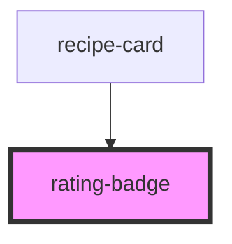

# rating-badge

<!-- Auto Generated Below -->

## Overview

`rating-badge` shows a difficulty indicator. Public-API recipes (e.g. from
TheMealDB) don't include this data, so the consuming app should only
render this for user-created recipes where difficulty was captured via
`recipe-form`.

## Properties

| Property     | Attribute    | Description | Type                           | Default  |
| ------------ | ------------ | ----------- | ------------------------------ | -------- |
| `difficulty` | `difficulty` |             | `"easy" \| "hard" \| "medium"` | `'easy'` |

## Dependencies

### Used by

 - [recipe-card](../recipe-card)

### Graph

----------------------------------------------

*Built with [StencilJS](https://stenciljs.com/)*
