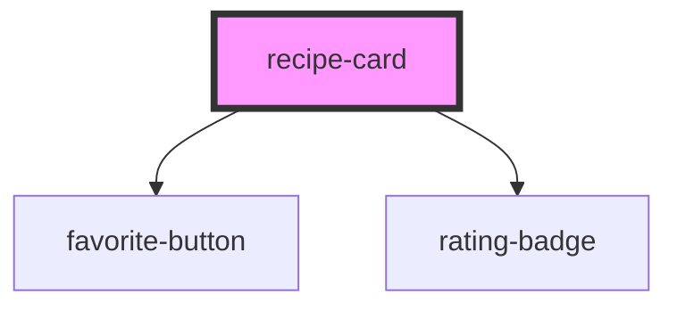

# recipe-card

<!-- Auto Generated Below -->

## Overview

`recipe-card` displays a single recipe summary for use in grids, search
results, and favorites lists. It composes `favorite-button` and
`rating-badge` internally, but the actual favorite/rating state is always
owned by the consuming app — this component is purely presentational and
communicates via events.

## Properties

| Property                | Attribute         | Description                                                             | Type                           | Default             |
| ----------------------- | ----------------- | ----------------------------------------------------------------------- | ------------------------------ | ------------------- |
| `cardTitle`             | `card-title`      | Recipe title.                                                           | `string`                       | `'Untitled recipe'` |
| `category`              | `category`        | Optional category/cuisine label, e.g. "Dessert" or "Italian".           | `string`                       | `undefined`         |
| `difficulty`            | `difficulty`      | Optional difficulty, only meaningful for user-created recipes.          | `"easy" \| "hard" \| "medium"` | `undefined`         |
| `image`                 | `image`           | Recipe thumbnail image URL.                                             | `string`                       | `''`                |
| `isFavorite`            | `is-favorite`     | Whether this recipe is currently in the user's favorites.               | `boolean`                      | `false`             |
| `isUserCreated`         | `is-user-created` | Whether this recipe was created by the user (vs. sourced from the API). | `boolean`                      | `false`             |
| `recipeId` _(required)_ | `recipe-id`       | Unique identifier of the recipe, passed back in emitted events.         | `string`                       | `undefined`         |

## Events

| Event            | Description                                                                                             | Type                                                     |
| ---------------- | ------------------------------------------------------------------------------------------------------- | -------------------------------------------------------- |
| `cardOpen`       | Fired when the card body (not the favorite button) is clicked — app should navigate to the detail page. | `CustomEvent<{ recipeId: string; }>`                     |
| `favoriteToggle` | Fired when the favorite toggle inside the card is pressed.                                              | `CustomEvent<{ recipeId: string; nextValue: boolean; }>` |

## Slots

| Slot       | Description |
| ---------- | ----------- |
| `"footer"` |             |

## Dependencies

### Depends on

- [favorite-button](../favorite-button)
- [rating-badge](../rating-badge)

### Graph

----------------------------------------------

*Built with [StencilJS](https://stenciljs.com/)*
